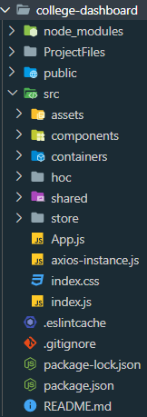
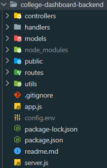

# College Dashboard

A MERN-based application that fetches data of colleges & students from APIs based on mock-data using self-created functions.<br>
| MERN |

# Documentation for the APIs:

### Two collections:

- Colleges: [Documentation Link](https://documenter.getpostman.com/view/11031021/TVzXAZyU)
- Students: [Documentation Link](https://documenter.getpostman.com/view/11031021/TVzXAZyY)

## Demo:

The live demo for the application can be found here:
[Link](https://college-dashboard-app.herokuapp.com)

## Folder Structure

##### Frontend

<p align="center">
  
</p>

##### Backend

<p align="center">
  
</p>

#### Recommended IDE

**VSCode**  
Others: Atom, Sublime or simply choose as per your comfortability and experience.

#### Knowledge

Stack: MERN - Node-Express-Mongoose + React-Redux
Database: MongoDB [Cloud: Atlas]  
Deployment [Optional]: Possibilities: AWS/Firebase/Localhost/Heroku/Netlify [Used here: [Heroku](https://devcenter.heroku.com/articles/heroku-cli) - Heroku Download]

#### Installation

##### Node Package Manager (NPM)

If you don't have it installed, go ahead and install it. Refer here to follow the steps: https://www.npmjs.com/get-npm

##### ReactJS Library

Download the 'react' and 'react-dom' packages using npm. Also, 'create-react-app' which creates a basic project layout for the application.

```
>> npm i react
>> npm i react-dom
>> npm i create-react-app -g ('-g' tag installs it globally to be accessed from anywhere)

```

##### Deployment

Heroku - both for backend (APIs) as well as the react application (having seperate URLs).

## Further Possibilities

- Improving the basic layout/project structure of the application
- Further separating the business-presentational logic
- Better use of redux store and/or use of redux-saga
- Design improvements are definitely possible

## Built With

- [NodeJS](https://nodejs.org/en/download/) - JavaScript Runtime Environment

* [ReactJS](https://reactjs.org/docs/getting-started.html) - JavaScript Library

- [Express](https://nodejs.org/en/download/) - Web Application Framework
- [VSCode](https://code.visualstudio.com/download) - IDE
- [MongoDB: ](https://www.mongodb.com/download-center/community) - Database /NoSQL/
- [Hosting on Atlas (cloud service): ](https://www.mongodb.com/cloud/atlas) - Cloud Database

* [Deploying on Heroku](https://dashboard.heroku.com/) - Cloud Hosting

- [Postman: ](https://www.postman.com) - API Testing
- [Optional] [GUI for MongoDB: ](https://www.mongodb.com/products/compass) - Software i.e. GUI version for MongoDB

## Authors

- **Mandeep Singh** - [Ryuk-hash](https://github.com/ryuk-hash)
